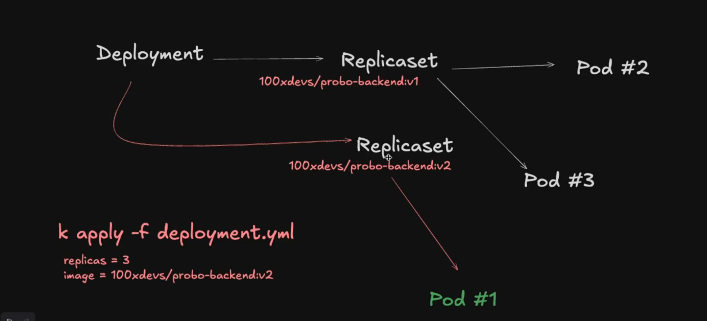

1. Resource constraints or limitations in cluster's pod

2. alias k=kubectl 

Replicas

kubectl create rs --replicas 3

rs.yml

k apply -f rs.yml

k get pods

k get rs

Deployment

k get deployment
k get rs
k get pods

Assignment

create a manifest.yml which starts
- A postgres db (1 replica)
- A custom node.js applicatiom that connects to postgres

## blue-green deployment